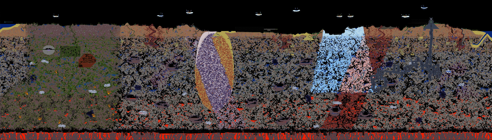

# 大世界 60 秒目标：首次渲染、预处理回放与分享图

> 最终采用 `f7ac441` 对应的运行实现，远端首次整图为 **105.770 秒 / 304.56 MB 保守总峰值**，比同机已有原生基线快 **16.69%**。**首次世界 60 秒与远端 300 MB 两个优先目标仍未达到，内存超出约 4.56 MB。** 允许提前准备固定世界时，首次准备为 **140.580 秒 / 295.50 MB**，随后混合命令与精确残余单元缓存的前台回放为 **14.763 秒 / 170.63 MB**，达到这两个目标。世界相关准备成本单列，不能用回放时间替代首次渲染时间。最终恢复每 4 个块主动 GC；每 2 个块的实验使远端首次渲染回退到 137.763 秒且仍超过 300 MB，因此被拒绝。

最终采用配置的被测渲染源码为 [`f7ac4416a9cb2229d84421d07d8d1f542e9074f5`](https://github.com/Live-yum/exploreTV/commit/f7ac4416a9cb2229d84421d07d8d1f542e9074f5)，此前阶段为 [`e2ca3ae45ab4f2f509f00db955aae7e5dcbb4607`](https://github.com/Live-yum/exploreTV/commit/e2ca3ae45ab4f2f509f00db955aae7e5dcbb4607)，改动均位于[草稿 PR #3](https://github.com/Live-yum/exploreTV/pull/3)。最终提交包含 GC 恢复与文档整理，运行实现对应 `f7ac441` 的 **52 项源码哈希**。[本地完整证据](benchmarks/overview-60s-local-20261006.json)保留各阶段的源码身份、完整进程寿命与像素验证。最终采用配置的[完整平台验证](https://github.com/Live-yum/exploreTV/actions/runs/37422281581)与[远端性能运行](https://github.com/Live-yum/exploreTV/actions/runs/37422281613)均已完成；旧阶段[远端记录](https://github.com/Live-yum/exploreTV/actions/runs/37420185630)在本页末尾单列，环境与版本之间不拼接计算加速倍数。

[远端证据 JSON](benchmarks/overview-60s-remote-20261006.json)归档远端各版本的完整测量与核验，用于区分最终采用配置、历史阶段和被拒绝实验。

被拒绝的 GC 实验为 [`29e4ebde11ad06181702a0b4aeb92d5a6307a31c`](https://github.com/Live-yum/exploreTV/commit/29e4ebde11ad06181702a0b4aeb92d5a6307a31c)，tree 为 `272bf98380e3244b73d1ecca33e8aa0b97d02ede`。其独立性能与 CI 证据在文末单列，不参与最终配置的耗时、峰值或包选择。

本文区分三种工作：第一次读取世界并生成全景、使用已准备的世界命令重新生成全景，以及把全景压缩成便于分享的小图。它们解决不同问题，计时也分别报告。

| 需要的结果 | 命令 | 开始时已有的内容 | 输出 |
| --- | --- | --- | --- |
| 首次为当前世界生成准确的静态概览 | `npm run export:overview` | `.wld`、真实纹理、世界无关的原生模块 | 默认 8400×2400 PNG 与渲染报告 |
| 为固定世界与固定范围建立可回放包，同时取得第一张图 | `npm run prepare:world` | 同上 | 混合命令/精确残余单元缓存、`preview.png`、准备报告 |
| 为已经准备的相同输入和范围重新生成 PNG | `npm run export:prepared` | 世界、纹理及匹配的缓存包 | 回放命令并复用残余单元，另生成相同 1 px/Tile 像素的 PNG 与报告 |
| 取得更小的分享图 | `npm run encode:overview` | 已完成的概览 PNG | 默认最大宽 4200 的有损 WebP 与编码报告 |

大世界默认 PNG 为每 Tile 1 像素，覆盖全部 8400×2400 个 Tile。分享图默认把该 PNG 按比例缩到 4200×1200，仍覆盖完整世界，但细节继续减少。PNG 是这一路径的精确参考；WebP 默认质量 85，明确采用有损编码。

## 既有工作的归属与比较起点

本轮从已有 [PR #2：`perf/overview-precompute`](https://github.com/Live-yum/exploreTV/pull/2) 继续工作。Node-API 原生整数合成、原生面积缩小、raw 帧直接准备、标准坡块缓存以及已有低内存参数，均属于该 PR 的既有工作，详见[原生整图概览](overview-native.md)。不能把这些收益重复记为本轮新增。

用户给出的历史远端记录是 **257.554 秒 / 302.17 MB**。PR #2 的后续远端验收已经达到 **125.064 秒 / 291.48 MB 保守总峰值**，仍未达到 60 秒目标。这两组来自不同历史运行，本轮加速比使用同一环境中的完整对照。已有证据分别见 [run 37395562331](https://github.com/Live-yum/exploreTV/actions/runs/37395562331)、[run 37408281055](https://github.com/Live-yum/exploreTV/actions/runs/37408281055) 和[固定远端测量 JSON](benchmarks/overview-native-20261006-final.json)。

PR #2 的远端性能源码为 `870c7e03db85e9051c4e315dd6e0c068a9eddde9`；当次 AMD EPYC 7763 runner、Node 22.23.3 的同机原版是 240.309 秒 / 297.81 MB。下面的新本地结果使用 Node 24.19.0，不能与那次远端时间直接拼接计算加速倍数。

## 1. 普通首次渲染

### 安装与使用

```sh
npm ci --ignore-scripts
npm run prepare:overview
MALLOC_ARENA_MAX=2 MALLOC_MMAP_THRESHOLD_=131072 npm run export:overview -- \
  fixtures/example-world.wld example/assets artifacts/world-overview.png \
  --expect-world-sha256 d551a6b360c7af49a07dadbb1e82223ac43ad398e2054c29f500ec5e8b5b1cab
```

`prepare:overview` 只提前编译与世界无关的原生模块，不读取世界或纹理。它需要锁定依赖和可用的 C 编译器；平台、构建记录与自动回退说明见[原生模块文档](overview-native.md#安装预处理导出)。上面的分配器变量面向 Linux/glibc；其他平台可以省略，性能与内存分别实测。

输出使用新路径。默认生成完整世界的 1 px/Tile PNG；可用 `--region x,y,width,height` 选择局部，用 `--pixels-per-tile 2|4|8` 导出较高细节的局部。完整 16 px/Tile 输出仍使用既有的 [`export:full`](full-resolution-export.md)。

首次渲染的计时包括进程启动、世界读取与哈希、索引、完整静态瀑布登记、PNG 纹理解码、从空开始的帧缓存、场景规划、合成、缩小、垃圾回收、PNG 压缩和写入，直到子进程退出。提前安装依赖、编译世界无关的原生模块以及另行执行的正确性核验单列。应用缓存是冷的，操作系统文件缓存状态不受控制。

### 本轮 direct terrain 路径

新增的[直接地形概览模块](../scripts/direct-terrain-overview.mjs)接收完整场景计划和已经加载、检查的资源视图。普通 16×16 方块和 32×32 墙保留短数值帧键；更一般的候选使用分别限定的帧键与准备器，减少重复的字符串处理、Map 查询、帧准备调度和验证循环。本轮没有把世界或纹理相关工作移出首次渲染计时。

| 直接处理的候选 | 约束与处理 |
| --- | --- |
| 普通完整方块与墙 | paint 0/31、无额外顶点着色、整数位置、原尺寸，使用数值帧键 |
| 通用 raw 矩形 | 每边 1–64 个原始像素、无缩放或 clip、paint 0/31、无额外顶点着色；包含符合条件的半块、液体与小型物件，支持精确量化 opacity 与翻转 |
| 四种标准 16×16 坡块 | 复用原帧准备器与[标准坡块适配器](../scripts/direct-slope-overview-frame.mjs)，保留原 paint、单色 vertex tint、clip、opacity 与翻转顺序；不接受逐角颜色或未识别的裁剪 |

模块分两遍处理当前块。第一遍仍验证每个候选的纹理、crop 和效果，并标记原路径必须处理的输出格。同时建立最终不透明覆盖证明：只有对齐的完整 16×16、无 clip、原帧确实不透明且实际 opacity 为 1 时，才记录其精确均值；任何后续候选触及此格都会取消旧均值，后续完整不透明覆盖可以建立新的均值。带标准 slope clip 的帧永远不提供完整格的均值。

第二遍按原顺序提交仍影响待合成安全格的命令。完全被最终不透明格覆盖的墙与方块可以不栅格化；跨越待合成格与均值格的墙仍整条绘制，归约时再使用经过证明的最终均值。两遍之间仅保存紧凑标记与每格均值，不保留每条命令的帧对象引用。若帧被淘汰后重新准备失败，整个 direct view 作废，完整原计划回到 generic。

其余正确性条件保持：

- 复杂命令按实际绘制范围标记需要原路径的输出格，包含来自邻块但纹理伸入当前块的贡献。未接受的非整数位置和裁剪增加保守边缘保护。
- 每条命令的 base 后立即 additive，保留半透明重叠、RGB 超过 alpha 和 alpha 为零时的发光分量。
- 标准坡块的 clip、opacity 和翻转在原 Canvas 顺序中一次烘焙；原生 descriptor 不重复应用这些效果，保留斜边的字节舍入。
- 跨越 direct 与 generic 输出格的墙参与所有必要的合成；最后只用 direct 结果覆盖已经证明安全的完整 1 px 输出格。
- 完整资源集合、原始计划、owner 计数、缺失资源、无效 crop 和不支持效果的报告保留。即使最终被不透明方块覆盖，也不跳过首次来源验证。

帧身份包括源对象、原始纹理注册对象和尺寸。通用 raw key 另外包含裁剪宽高和精确量化 opacity；slope key 包含完整效果帧键、实际裁剪形状、两种翻转和精确量化 opacity。量化复用 `quantizeCanvasOpacity`，包含原有浮点舍入步骤。重新注册、替换来源或改变尺寸会生成新身份。

保留帧、当前批次活动引用及成功扩展 key 的保守 UTF-16 字节共同受 **4 MiB** 上限约束。失败字符串 key 不存入负缓存。旧阶段 `e2ca3ae` 的 direct 详细核心缓冲上限为 **6 MiB**，generic 另外持有自己的详细像素缓冲及 **8 MiB** 帧缓存；当前版本进一步收紧了这些占用。

最终采用的 `f7ac441` 实现仅在 direct 启用时，将 generic 帧缓存及活动引用的联合上限降为 **2 MiB**，并让 direct/generic 借用同一个 **6 MiB** 详细像素缓冲；主动 GC 默认每 **4** 个块执行。该缓冲首次需要时一次分配完整容量，后续只借用不同长度的前缀，不增设第二份详细缓冲；direct 完成缩小后立即归还，独立的 1 px 结果继续有效。generic 成功输出在下一次 draw 前仍可供缩小读取，完成绘制只释放计划、资源与帧引用；下一次 draw、dispose 或本 view 的失败路径才归还像素借用。旧 view 的迟到清理不能归还新 view 的借用。世界准备录制和 direct 关闭的路径仍用原 **8 MiB** generic 帧预算。描述符、标记数组与进程本身另计，局部预算不等于总 RSS 上限。本地及远端完整运行已验证像素正确性，**最终配置远端保守总峰值仍为 304.56 MB**。

已验收版本的 direct 缓存采用有界 CLOCK：命中时只设置 recent 标记，容量不足时才移动或淘汰条目；一次压力扫描最多访问初始条目数的两倍，活动批次 pin 的帧不会被淘汰。原 4 MiB 上限保持不变。generic 结果缩小时还会复用已经完成的 direct 安全格像素，省去对这些格的重复面积归约；Canvas、旧 opaque 和最终 direct 的合并顺序保持。

本分支在符合条件的 1 px/Tile raw 导出中默认启用这条路径，使用 `EXPLORETV_DISABLE_DIRECT_TERRAIN=1` 可执行对照；两次对照应使用相同安装和参数、不同的新输出路径。复杂命令很多时仍可能出现两条路径的重复绘制，普通全安全块的局部性能不能代表整图性能。

### 本地完整首次渲染结果

| 记录 | 完整进程耗时 | 保守总峰值 | 范围与状态 |
| --- | --- | --- | --- |
| 本轮本地原生基线 `b9b0fdd6` | 97.588 秒 | 251,949,056 B，251.95 MB | 同环境已有 PR #2 原生实现 |
| 已验收阶段：两遍 direct、通用 raw 与标准 slope | **86.673 秒** | **273,756,160 B，273.76 MB** | **全部像素、13 个独立窗口及资源/逻辑计数对照通过** |
| 已验收源码 `e2ca3ae`：复用归约结果、有界 CLOCK | **81.100 秒** | **273,223,680 B，273.22 MB** | **有效 PNG、全部像素、13 个窗口及资源/逻辑计数对照通过** |
| 最终采用 `f7ac441`：共享详细像素、direct 模式 generic 2 MiB、GC 间隔 4 | **83.116 秒** | **259,354,624 B，259.35 MB** | **有效 PNG、全部像素、13 个窗口及资源/逻辑计数对照通过** |
| 被拒绝实验 `29e4ebd`：direct 非录制路径每 2 个块主动 GC | 100.995 秒 | 258,297,856 B，258.30 MB | 像素正确性通过，性能回归；不作为最终配置 |

`29e4ebd` 相对 `f7ac441` 本地只减少 **1,056,768 B（1.06 MB）**，耗时增加 **17.879 秒**；相对原生基线 `b9b0fdd6` 反而多用 **3.407 秒（3.49%）**。该实验主动 GC 阶段共 **12.459 秒**，报告记录 major/minor 各 **1,650 次**、band **50 次**。其远端测量也出现性能回归且没有降至 300 MB，因此最终拒绝更密集 GC。该实验的本地保守峰值由 exporter **206,266,368 B**、Node harness **45,219,840 B**、原生 monitor **5,763,072 B** 与 **1 MiB** 尾部预留组成，不能用 exporter 单独峰值替代总数。

`f7ac441` 与本地同环境原生基线相比，耗时减少 **14.472 秒（14.83%）**，保守峰值增加 **7,405,568 B（7.41 MB）**。相较旧阶段 `e2ca3ae`，当前运行多用 **2.016 秒**，保守峰值减少 **13,869,056 B（13.87 MB）**。应用使用新进程和空缓存，操作系统文件缓存不受控制；这是单次本地对照，不能与不同机器上的远端时间拼接计算加速倍数。**本地 300 MB 优先内存目标通过，首次世界的 60 秒目标未通过，还差 23.116 秒；该版本远端内存目标未通过，见末尾记录。** exporter 单独峰值为 207,814,656 B，但本地结论使用包含监测开销的 259,354,624 B 保守总峰值。

`f7ac441` 本地运行 `artifacts/shared-cold/` 的 PNG 为 **8400×2400、16,984,482 字节**，文件 SHA-256 为 `6e0dc1fc0b85c3acd7b537e66d3d191cbebd5f0c000b5a230ec09d1f13fd7e5c`，与旧阶段 `artifacts/final-cold/` 的输出文件完全相同。全部 20,160,000 个像素匹配固定 RGBA SHA-256 `7564e85d94724f452cd76c03409fea512fb57966fb933303a6db832d4b86013e`；13 个独立高细节窗口逐字节相同，**52 份源码身份**、384 张纹理以及逻辑命令计数通过核验。PNG 完整压缩流、所有 CRC 和 IEND 检查也通过。

[本地完整证据 JSON](benchmarks/overview-60s-local-20261006.json)归档了基线、各阶段生成及核验记录。当前共享 arena 的 `allocations=1`，实际容量 **6,291,456 B**，direct 与 generic 的 private 详细缓冲均为 **0 B**；generic 帧峰值 **2,097,152 B**。收紧缓存后 generic misses 从 2,940 增至 **4,231**、hits 从 53,108 变为 **51,817**，产生 **3,285** 次淘汰，说明节省内存同时增加了帧准备工作。direct misses 仍为 **62,906**，第二遍 miss 仍为 **0**。

此前 `e2ca3ae` 的 direct misses 从更早阶段的 78,668 降至 62,906，读回和归约从约 6.40 秒降至 3.97 秒。这些阶段数据用于解释变化，完整进程时间仍以上表为准，不能把相互嵌套的计时再次相加，也不把旧阶段计时视为当前源码的测量。

早期约 100–101 秒的运行只保留为诊断试验：进程报告与随后读到的文件不一致，PNG 核验报缺少 IEND，未通过有效产物验收。文件路径同步的原因尚未确认，这些记录不进入成功性能对照，也不作为画面保真证据。上表采用的是后续在连续流程中完成导出及立即核验的成功运行。

## 2. 按世界预处理与 command tape 回放

### 使用方式

```sh
MALLOC_ARENA_MAX=2 MALLOC_MMAP_THRESHOLD_=131072 npm run prepare:world -- \
  fixtures/example-world.wld example/assets artifacts/example-world-tape \
  --expect-world-sha256 d551a6b360c7af49a07dadbb1e82223ac43ad398e2054c29f500ec5e8b5b1cab
```

这次命令已经生成 `artifacts/example-world-tape/preview.png`。同时保存 `frames.bin`、`commands.bin`、`manifest.json`、`preparation.json` 和首张图的报告。准备目录必须不存在；它是与这份世界和纹理绑定的输出包。

性能工作流分开上传两类 artifact：约 **21 MB** 的证据与图像包，以及约 **61.3 MB** 的可回放包，已验收阶段的下载链接见文末。可回放包仅含 `manifest.json`、`frames.bin`、`commands.bin` 和 `preparation.json`，保留 **7 天**；`preview.png` 是准备时顺便生成的首张图，并非回放的必需文件。下载包后仍须使用它绑定的相同世界、资源、运行源码及匹配的原生模块。体积是本例的量级，实际上传大小以每次运行记录为准；工作流 artifact 的保留期也不等于长期存储承诺。

之后可以用相同输入重新生成一张 PNG：

```sh
MALLOC_ARENA_MAX=2 MALLOC_MMAP_THRESHOLD_=131072 npm run export:prepared -- \
  fixtures/example-world.wld example/assets artifacts/example-world-tape \
  artifacts/world-replayed.png --compression-level 6
```

当前支持 **1 px/Tile、`tconvert-game-raw`**。准备时可以指定 overview 的区域与分块参数，回放使用包中记录的相同区域和布局；回放只提供 PNG 压缩级别选项。两种命令都要求已经准备好的原生合成与缩小模块。

如果需求只是多次取得同一张静态图片，保存并复用已经生成的 PNG/WebP 即可。这个包针对准备时的世界、固定范围与渲染选项，提供混合命令回放和已求得输出单元复用的能力；它不是世界无关的资源预处理包。

### 准备了什么

[世界命令包模块](../scripts/prepared-world-tape.mjs)在首次准备中记录原生合成成功批次，使用整数 frame ID 连接压缩、去重的原始帧；命令保留原有顺序、目的位置、翻转及混合方式。准备时还保存每个块相对原生面积缩小结果的精确残余单元：这些是已经求得的最终 1 px/Tile RGBA 值，包含旧 opaque 快捷路径和需要 Canvas 的复杂像素贡献。

回放执行已记录的指令、进行面积缩小，再直接覆盖这些精确残余 RGBA 值，不需要重新运行世界规划、纹理 PNG 解码或 Canvas 帧准备。**这是一份混合命令与最终单元缓存，不是把所有输出单元从头重新光栅化。** 每块结果与准备时的完整 RGBA SHA-256 核对，全部块按固定网格写出并核对全图像素 SHA-256。准备过程关闭新增 direct terrain 路径，确保记录器取得原 generic native 的完整批次流。

本次 `e2ca3ae` 本地大世界包包含 **9,781 个去重帧、3,300 个块、11,333,425 条命令，以及 5,590,895 个精确残余输出单元**。`f7ac441` 远端包的这四项数量相同。残余单元约占全部 20,160,000 个输出格的 **27.73%**，这些格在回放最终合并时直接复用准备结果。

| `e2ca3ae` 本地有效包文件 | 字节数 |
| --- | ---: |
| `frames.bin` | 1,662,019 |
| `commands.bin` | 57,301,163 |
| `manifest.json` | 2,334,659 |
| 三文件合计 | **61,297,841 B，约 61.30 MB** |

上述大小不包括首张 PNG、附加报告和测量文件；不代表只付出 61.30 MB 磁盘空间就省略了首次准备计算。`f7ac441` 远端包的有效三文件为 **61,292,640 B**，其包含 `preparation.json` 的下载 artifact 为 **61,294,821 B**；文件大小与来源版本分别记录，不把不同版本的包视为可互换。

### 失效条件与边界

每次回放首先核对当前世界 SHA-256、参与规划的纹理、当时缺失或失败的纹理状态、记录的渲染源码、原生核心源码和依赖锁文件。补齐一张先前缺失的纹理也会使包失效，避免继续复用旧遗漏。世界、相关资源或实现改变后，使用新目录重新准备。内部记录另外验证文件、区块和帧的长度、哈希、索引范围及完整网格，不能把文件存在视为缓存有效。

默认包总字节预算为 **512 MiB**，包含指令、帧与 manifest；每块压缩记录上限和解压记录上限分别为 **16 MiB**，回放帧缓存及活动引用共同受 **8 MiB** 上限约束，另有帧数量、块数量和索引上限。首张 PNG、附加报告与临时文件不包括在这项包预算内。大型或复杂世界可能触发预算错误，应查看失败报告；不存在整包可无限增长的承诺。

准备与回放拒绝覆盖已有目标，未完成的临时记录不会作为已发布包使用。发布完整 manifest 后若附加报告写入失败，已经提交的有效包会保留；应检查最终报告和错误信息，避免把一次异常简单视为所有文件均已回滚。

### 必须分别报告的时间

首次准备包含世界相关工作、指令记录与压缩、输入复核以及第一张 PNG。首次准备已经产生可用图，通常不需要紧接着为同一次使用额外回放。

在线回放时间包括新进程启动、当前世界/纹理/源码/包的完整验证、帧解压、原生命令执行、缩小、精确残余单元覆盖、PNG 压缩与写入。准备时间单独列出。若为了展示回放额外执行一次，两次生成进程耗时为准备加回放，不能把回放时间填入普通首次渲染一栏。

以下保留 `e2ca3ae` 的完整本地准备与回放记录；`f7ac441` 的远端重新测量见文末独立表格，两种环境不混用。

| `e2ca3ae` 本地完整世界阶段 | 完整进程耗时 | 保守总峰值 | 必须同时附带的证据 |
| --- | --- | --- | --- |
| 第一次准备，包含 `preview.png` | **113.471 秒** | **262,811,648 B，262.81 MB** | 完整准备、有效包与首张图全部像素核验通过 |
| 已准备的世界回放 | **14.085 秒** | **145,428,480 B，145.43 MB** | 输入/包绑定验证、全部像素及独立窗口核验通过 |
| 准备后额外回放一次，两次生成进程之和 | **127.556 秒** | **262.81 MB，顺序阶段峰值上界** | 两个阶段均成功退出，未并行运行 |

原始完整进程时间分别为 113.470938916 和 14.085182986 秒，合计 127.556121902 秒。该合计不包含另行执行的独立正确性核验和阶段间调度等待，计时口径与普通导出一致。**低于 60 秒的是已有世界与固定范围的缓存回放，不是此前未见世界的首次生成。**

首张 `preview.png` 为 16,984,482 字节，与最终普通导出拥有相同 PNG 文件 SHA；回放 PNG 为 16,984,470 字节，文件 SHA 为 `67022ee2a93ab79881402fd3c5612c05ead556f8a821ef45129fa6bc9798be85`。二者解码后的全部 RGBA 像素都与固定基线一致；PNG 分块不同造成文件字节不同。完整记录来自 `artifacts/final-prepared/prepare-runtime.json` 与 `replay-runtime.json`，已收录在[本地证据 JSON](benchmarks/overview-60s-local-20261006.json)。

文件内 `firstPreparationSeconds` 是报告中说明边界的阶段计时；最终对外耗时使用完整进程寿命测量，包含最终发布和退出。回放报告的 `executionMode` 为 `prepared-command-replay`，逻辑覆盖与 omission 证据来自严格绑定的那次准备，像素结果在回放时重新核对。

## 3. 生成体积更小的分享图

等待 PNG 导出进程完全退出后，在独立进程中运行：

```sh
npm run encode:overview -- artifacts/world-overview.png artifacts/world-share.webp
```

等价的显式选项为：

```sh
npm run encode:overview -- artifacts/world-overview.png artifacts/world-share-custom.webp \
  --quality 85 --max-width 4200
```

默认 `max-width=4200`，保持比例并使用高品质重采样；较小的源图不放大。`--quality` 接受 0–100 的整数，`--max-width` 接受 1–8400 的整数。提高 quality 不提供与源 PNG 像素相同的保证，输出报告记录实际 WebP 压缩类型；保真核验继续使用 PNG。

编码器仅接收项目导出的非交错 RGBA8 PNG，源图最大 8400×2400、输入文件最大 128 MiB，并另外执行像素数和 WebP 边长检查。16 px/Tile 超大 PNG 不在支持范围内。先验证完整 PNG 的 CRC、压缩流、尺寸与 SHA，再交给原生图片解码器；这也避免让原生解码器直接处理已知可能引发崩溃的截断输入。

缩放后只让目标 Canvas 保留到 WebP 编码阶段，先释放源 PNG/Image 的引用，执行显式 GC、让出事件循环，并在可用时归还空闲分配器页。npm 入口已经传入 `--expose-gc`。输出 WebP 或同名报告已存在时会拒绝覆盖。

### 本轮已完成的独立编码测量

输入为本轮已生成的 8400×2400 PNG，**16,984,422 字节**。以下只测已有 PNG 的后处理，不包含世界渲染：

| 配置 | 输出尺寸 | WebP 字节数 | 相对 PNG 减少 | 完整进程耗时 | 保守总峰值 |
| --- | --- | --- | --- | --- | --- |
| 默认 `quality=85, max-width=4200` | 4200×1200 | **1,503,034 B，约 1.50 MB** | **91.15%** | **1.523 秒** | **263,667,712 B，263.67 MB** |
| 显式 `quality=85, max-width=8400` | 8400×2400 | 4,866,090 B，约 4.87 MB | 71.35% | 2.678 秒 | 411,213,824 B，411.21 MB |

默认尺寸同时减少像素数并采用有损压缩；因此其 91.15% 体积减少不能单独归因为 WebP 编码。8400 宽选项可以保留源图尺寸，但这次实测的峰值明显更高，不作为默认低内存配置。

远端阶段 `e2ca3ae` 的同配置分享编码单独测得 **1.283930 秒**，encoder 完整寿命 OS 峰值 **235,679,744 B**，原生 monitor 峰值 **1,421,312 B**。后续 `f7ac441` 远端同配置耗时 **1.292159 秒**；两次输出均为 **1,503,034 字节**及相同 WebP SHA。远端编码测量没有 Node harness，不能把上述 `e2ca3ae` 的两个分量直接当作与本地 263.67 MB 相同口径的保守总峰值，也不能当作 `f7ac441` 的内存测量。

原始报告为 `artifacts/world-share-4200.webp.json`、`artifacts/webp-4200-runtime.json`、`artifacts/world-share.webp.json`、`artifacts/webp-runtime.json`，测量随[本地证据](benchmarks/overview-60s-local-20261006.json)归档。默认报告的完整来源 PNG SHA-256 为 `04e21f5e9f09c2ce3680f4b8440ea1000dba753e83eba571b32d3fc8173ad7d2`，WebP SHA-256 为 `4c7fc9fc5e4d554d71910c238f53c887f4bdfbe3d94a543aada113aa1ef034ab`。这是同像素内容的较早 PNG 编码，来源文件哈希与最终 PNG 分别记录。

[查看或下载 1.50 MB 分享图](benchmarks/large-world-share.webp)：



渲染和分享编码严格顺序执行时，耗时相加；两个已经退出的独立进程的峰值不相加。完整“世界到分享图”的峰值上界取两个阶段相同统计口径的较大值。若并行运行，必须重新测量同时占用。

## 4. 画面保真范围与固定版本源码依据

性能改动的精确性目标是：保留已有 renderer 的静态 fullbright 场景、真实纹理、已实现的框架/形状/染色/液体/瀑布规则、遮挡顺序及遗漏报告，并与独立完整细节缩小基线逐像素相同。它不会自动补齐游戏实时照明、动态实体、粒子或尚未实现的拼接规则。

1 px/Tile 的 PNG 把每个 16×16 原始区域缩为一个像素，已经减少细节；PNG 的无损压缩只保留这个缩小结果。默认 4200 宽 WebP 又缩小一倍并有损编码。全世界覆盖、原始纹理细节、静态像素一致以及游戏运行时画面等价，是不同的验收项。

固定 Terraria 源码 commit 为 [`8255d34616c780af12079425ac92a0a7aed87d71`](https://github.com/Live-yum/TerrariaDecompiledSource/tree/8255d34616c780af12079425ac92a0a7aed87d71)，关键依据如下：

| 源码事实 | 对实现与预计算的影响 | 固定源码 |
| --- | --- | --- |
| `importance=true` 才从世界文件恢复 Tile 的 frameX/Y，其他 Tile 设置为 −1 | 普通地形仍需根据邻域重建框架；不能把全部纹理坐标当作存档已有字段 | [Terraria.IO/WorldFile.cs，2568–2582](https://github.com/Live-yum/TerrariaDecompiledSource/blob/8255d34616c780af12079425ac92a0a7aed87d71/Terraria.IO/WorldFile.cs#L2568-L2582) |
| 普通方块的 cosmetic framing 有专门入口与邻域处理 | 资源预切帧可复用；世界中选哪个帧仍与邻域有关 | [Terraria/WorldGen.cs，82677–82720](https://github.com/Live-yum/TerrariaDecompiledSource/blob/8255d34616c780af12079425ac92a0a7aed87d71/Terraria/WorldGen.cs#L82677-L82720) |
| 墙使用 32×32 源矩形，并放到 Tile 坐标乘 16 后减 8 的位置 | 墙会跨 Tile 边界；需要按完整覆盖范围与原顺序合成 | [WallDrawing.cs，74–99](https://github.com/Live-yum/TerrariaDecompiledSource/blob/8255d34616c780af12079425ac92a0a7aed87d71/Terraria.GameContent.Drawing/WallDrawing.cs#L74-L99)、[119–151](https://github.com/Live-yum/TerrariaDecompiledSource/blob/8255d34616c780af12079425ac92a0a7aed87d71/Terraria.GameContent.Drawing/WallDrawing.cs#L119-L151) |
| 墙框架依赖邻接、变体和查表 | 单独给每种墙预存一张缩略图不能代替世界中的实际墙框架 | [Terraria/Framing.cs，326–407](https://github.com/Live-yum/TerrariaDecompiledSource/blob/8255d34616c780af12079425ac92a0a7aed87d71/Terraria/Framing.cs#L326-L407) |
| 游戏普通墙取 `Lighting.GetColor`，fullbrightWall 才覆盖为白色；方块也有 fullbrightBlock 覆盖 | 现有全亮概览与完整游戏光照仍有范围差异 | [WallDrawing.cs，95–99](https://github.com/Live-yum/TerrariaDecompiledSource/blob/8255d34616c780af12079425ac92a0a7aed87d71/Terraria.GameContent.Drawing/WallDrawing.cs#L95-L99)、[TileDrawing.cs，4394–4420](https://github.com/Live-yum/TerrariaDecompiledSource/blob/8255d34616c780af12079425ac92a0a7aed87d71/Terraria.GameContent.Drawing/TileDrawing.cs#L4394-L4420) |
| LightMap 运行两次 BlurPass，每次横纵双向传播，并按介质衰减 | 完整光照是世界相关计算，不能只由资源平均色预计算得到 | [Terraria.Graphics.Light/LightMap.cs，86–115](https://github.com/Live-yum/TerrariaDecompiledSource/blob/8255d34616c780af12079425ac92a0a7aed87d71/Terraria.Graphics.Light/LightMap.cs#L86-L115)、[177–230](https://github.com/Live-yum/TerrariaDecompiledSource/blob/8255d34616c780af12079425ac92a0a7aed87d71/Terraria.Graphics.Light/LightMap.cs#L177-L230) |

纹理来源应固定到用户指定的 [TConvert 资源版本](https://github.com/Live-yum/TConvert/tree/1bf78d08842574d959cec35d566fe95ddeef28f8/1.4.5.8ouput/Images)。项目本次计算仍按实际所需资源的 SHA 绑定，资源目录中存在更多贴图不表示所有动态渲染效果已经实现。其他支持范围参见[渲染范围](rendering-scope.md)、[染色与通道](paint-scope.md)、[液体与光照](liquid-lighting-scope.md)。

## 5. 验收与报告阅读

使用项目示例时，先确认原生模块实际启用，再执行独立核验：

```sh
node scripts/check-overview-native.mjs
node scripts/verify-overview.mjs \
  fixtures/example-world.wld example/assets artifacts/world-overview.png --example
```

普通导出报告和 prepared 回放报告使用相同的覆盖与 omission 字段，并用 `executionMode` 区分执行方式。既有固定基线的完整 RGBA SHA-256 为 `7564e85d94724f452cd76c03409fea512fb57966fb933303a6db832d4b86013e`，涵盖 20,160,000 个输出像素；依据见[远端固定证据](benchmarks/overview-native-20261006-final.json)。PNG 压缩或 IDAT 分块不同可能改变文件 SHA，验收应比较解码像素及渲染覆盖，而不是只比较 PNG 文件哈希。

保守总峰值按 exporter、原生 monitor、Node harness 的完整寿命 OS 峰值之和，加 1 MiB 尾部预留；这包含原生内存，不能用 JavaScript heap 或单独 exporter RSS 替代。分享编码表同样采用这一口径。MB 使用十进制，MiB 使用 1,048,576 字节。

`cold-benchmark.json` 的 `targetPassed` 检查既有 600 秒 / 500 MB 硬防护。60 秒和 300 MB 优先目标分别看 `preferredRuntimePassed` 与 `preferredMemoryPassed`，不能因为 `targetPassed` 为 true 就宣称达到 60 秒。

### 最终配置的平台验证与各阶段远端性能

最终采用的 `f7ac4416a9cb2229d84421d07d8d1f542e9074f5` 运行实现已通过[远端完整平台验证](https://github.com/Live-yum/exploreTV/actions/runs/37422281581)：JavaScript **750 项中 747 通过、0 失败、3 跳过**；跳过项为私有真实地图 fixture、未启用的可选真实世界 streaming，以及未单独编译的可选 scalar native。Rust **4 项**、Playwright **22 项**（47.6 秒），以及 WASM 重建、H5/微信构建和相关平台检查通过。此前 `e2ca3ae` 的 741 项 JavaScript 验证记录保留在[历史运行](https://github.com/Live-yum/exploreTV/actions/runs/37420185717)，不作为 `f7ac441` 的验证次数。

[run 37420185630](https://github.com/Live-yum/exploreTV/actions/runs/37420185630) 的同机结果如下，各生成阶段的完整像素与 13 个独立窗口全部通过：

| 远端阶段 | 完整进程耗时 | 保守总峰值 |
| --- | ---: | ---: |
| 同机已有原生基线 | 125.218 秒 | 295,272,448 B，295.27 MB |
| `e2ca3ae` 普通首次整图 | **108.085 秒** | **308,580,352 B，308.58 MB** |
| 固定世界首次准备，包含首张图 | 141.547 秒 | 293,113,856 B，293.11 MB |
| 已准备世界的混合缓存回放 | **14.667 秒** | **170,213,376 B，170.21 MB** |

普通首次渲染比同机基线快 **13.68%**，保守峰值增加 **13,307,904 B（13.31 MB）**。**该版本在远端没有通过 60 秒和 300 MB 两个优先目标；低于 60 秒的仍是包含世界相关缓存复用的回放。** 远端准备与回放原始时间分别为 141.546784371 和 14.666537988 秒；若准备后额外回放一次，两次生成进程合计 156.213322359 秒。

最终采用的 `f7ac441` 配置在[同机远端 run 37422281613](https://github.com/Live-yum/exploreTV/actions/runs/37422281613)中完成冷渲染、准备、回放及对应像素核验：

| `f7ac441` 远端阶段 | 完整进程耗时 | 保守总峰值 |
| --- | ---: | ---: |
| 同机已有原生基线 | 126.963 秒 | 294,899,712 B，294.90 MB |
| 普通首次整图 | **105.770 秒** | **304,562,176 B，304.56 MB** |
| 固定世界首次准备，包含首张图 | 140.580 秒 | 295,501,824 B，295.50 MB |
| 已准备世界的混合缓存回放 | **14.763 秒** | **170,631,168 B，170.63 MB** |

普通首次渲染比该次同机基线快 **16.69%**，保守峰值增加 **9,662,464 B（9.66 MB）**。**最终配置的首次世界仍未通过远端 60 秒和 300 MB 两个优先目标，峰值超出 300 MB 约 4.56 MB。提前准备后的前台回放通过两个目标。** 准备与回放原始时间分别为 140.579856313 和 14.763191834 秒；准备后再额外回放一次，两个生成进程共 **155.343048147 秒**，顺序阶段峰值上界 **295.50 MB**。这一总时间不包含另行执行的核验与阶段调度等待。

该次运行的[证据与图像 artifact](https://github.com/Live-yum/exploreTV/actions/runs/37422281613/artifacts/11393049138)为 **21,191,152 B**；[可回放包 artifact](https://github.com/Live-yum/exploreTV/actions/runs/37422281613/artifacts/11393393625)为 **61,294,821 B**，仅包含有效三文件及 `preparation.json`，无需 `preview.png`。后者保留 **7 天**，绑定 `f7ac441` 对应的运行源码哈希及本次世界、资源。最终配置恢复这些运行源码；相关源码或输入再次改变后必须重新准备。

### 被拒绝的 GC2 实验 `29e4ebd`

该实验仅将 direct 非录制路径的主动 GC 间隔由每 **4** 个块收紧为每 **2** 个块，准备录制与 direct 关闭的路径不变。[同机远端 run 37424019948](https://github.com/Live-yum/exploreTV/actions/runs/37424019948)已完整结束：

| `29e4ebd` 实验阶段 | 完整进程耗时 | 保守总峰值 |
| --- | ---: | ---: |
| 该次同机原生基线 | 128.084 秒 | 296,546,304 B，296.55 MB |
| GC2 普通首次整图 | **137.763 秒** | **300,666,880 B，300.67 MB** |
| 该实验世界准备 | 148.057743112 秒 | 295,219,200 B，295.22 MB |
| 该实验世界回放 | 14.160975 秒 | 166,834,176 B，166.83 MB |

GC2 首次整图比自身同机原生基线慢 **7.56%**，保守峰值仍多 **4,120,576 B**；60 秒和 300 MB 两个目标均失败。因此最终拒绝该变更，恢复 `f7ac441` 的 GC4 配置。**这里的 14.160975 秒回放只能属于该实验，不能与最终 105.770 秒首次渲染或最终包混搭。**

该实验自身的[远端完整平台验证 run 37424019843](https://github.com/Live-yum/exploreTV/actions/runs/37424019843)通过：JavaScript **750 项中 747 通过、0 失败、3 跳过**（26.443 秒）；Rust **4 项**、Playwright **22 项**（52.9 秒）、waterfall browser worker **1 项**，以及 WASM 重建、H5/微信构建、真实世界 JS/WASM 检查均通过。像素正确和平台测试通过，不抵消实测性能回归。

为保留可复核证据，该失败实验另有[证据 artifact](https://github.com/Live-yum/exploreTV/actions/runs/37424019948/artifacts/11394920880)（21,191,205 B）和[实验包 artifact](https://github.com/Live-yum/exploreTV/actions/runs/37424019948/artifacts/11395145451)（61,294,860 B）。它们属于 `29e4ebd`，**不是最终采用配置的包**；最终交付使用前一节的 `f7ac441` 包。
